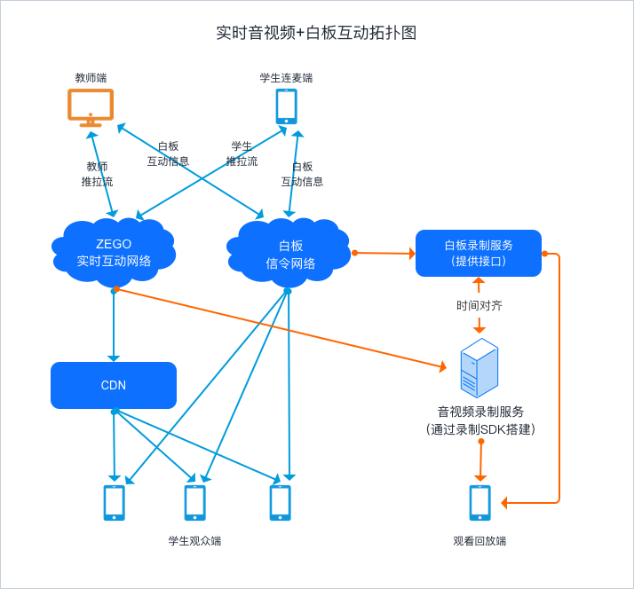
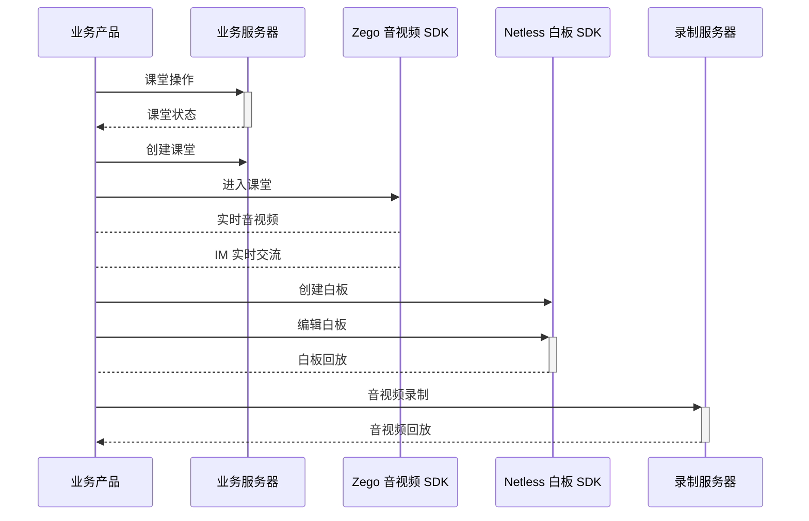

# ZEGO 实时音视频和互动白板解决方案

## 一、概述
&emsp;&emsp;进入2008年以后，课外辅导需求开始大幅增长，录播视频形式出现， 学生得以观看到完整的课程内容，但内容粗糙、管理服务不完善，导致学习效果不理想。直到2013年，伴随着带宽扩容、 4G网络和智能终端的普及，巨头进入、资本进入，正式意义上的在线教育元年才到来，从业者纷纷探索多个赛道，在线教育的服务和产品逐渐开始标准化。2016年下半年开始至今，行业开始摸索如何在线上实现比线下更个性化的体验和更好的效果，如果能解决这两大难题，K12在线教育市场将迸发出远比线下市场更强劲的生命力。 
为在线教育行业赋能更多能力，提升在线教育行业的互联网体验，即构科技推出了全方位的在线教育技术解决方案，实现实时音视频与互动白板之间的联通，让在线教育机构能够更加快速实现更优质的线上课堂。

&emsp;&emsp;技术解决方案提供的4大基础能力：实时音视频，互动白板，混流服务，录制服务。


## 二、技术方案
### 1. 架构图


### 2. 时序图


### 3. 技术栈
- Electron + Browser
- ReactJS
- Typescript
- Webpack
- React Router


### 4. 平台支持
- Zego LiveRoom 音视频 SDK (支持 Windows、macOS、Android、iOS、Web、Electron、Flutter)
- Netless 白板 SDK（支持 Android、iOS、Web）


## 三、功能实现

#### 1. PC端功能实现
##### 1）时序图：

##### 2）实时音视频-Electron：
- 集成 Zeogo 音视频 SDK-Electron，可参考即构官方开发者文档： [快速开始-集成](https://doc.zego.im/CN/200.html) 
- 核心代码：

```js
var ZegoLiveRoom = require("zegoliveroom/ZegoLiveRoom.js");
var zegoClient = new ZegoLiveRoom();

// initSDK
var ret = zegoClient.initSDK({
  app_id: app_id,           // appid
  sign_key: sign_key,       // app key
  user_id: TEST_USER_ID,    // 用户id
  user_name: TEST_USER_NAME // 用户名字
}, rs => {
  if (rs.error_code == 0) {
    console.log("sdk初始化成功");
  } else {
    console.log("sdk初始化失败,错误码为：" + rs.error_code);
    zegoClient.unInitSDK();
  }
});
if (ret) {
  console.log("正在初始化...");
} else {
  console.log("sdk初始化失败");
  zegoClient.unInitSDK();
}

// loginRoom
var ret = zegoClient.loginRoom({
 room_id: TEST_ROOM_ID,                    // 房间id
 room_name: TEST_ROOM_NAME,                // 房间名字
 role: ZEGOCONSTANTS.ZegoRoomRole.Audience // 房间角色
}, rs => {
 console.log("登录结果返回 ", rs);
 if (rs.error_code == 0) {
   console.log("登录成功");
 } else {
   console.log("登录失败，错误码为：" + rs.error_code);
 }
});

// startPreview
var set_ret = zegoClient.setPreviewView({
 // 设置canvas
 canvas_view: document.getElementById("localVideo"),
 // 通道索引，默认主通道
 channel_index: ZEGOCONSTANTS.PublishChannelIndex.PUBLISH_CHN_MAIN
});
if (set_ret) {
 // 开始预览 
 let preview_ret = zegoClient.startPreview({
   channel_index: ZEGOCONSTANTS.PublishChannelIndex.PUBLISH_CHN_MAIN
 });
 console.log("预览结果", preview_ret);
}

// startPublish
var ret = zegoClient.startPublishing({
 title: "zego electron simple test xx",// 推流标题
 stream_id: TEST_PUB_STREAM_ID,// 推流id
 // 推流flag，连麦、混流还是单主播
 publish_flag: ZEGOCONSTANTS.ZegoPublishFlag.ZEGO_JOIN_PUBLISH, 
 params: ""// 推流参数
});

// playStream
zegoClient.startPlayingStream({
  stream_id: TEST_PLAY_STREAM_ID,                      // 拉流id
  canvas_view: document.getElementById("remoteVideo"), // 设置播放的canvas
  params: ""                                           // 拉流参数
});


var recordUrl = "https://record.zegonetwork.com:8000";

// endRecord
function startRecord(param) {
  return fetch(`${recordUrl}/start`, {
    headers: { "content-type": "application/json" },
    mode: "cors",
    method: "POST", body: JSON.stringify({
      app_id: param.appId,
      room_id: param.roomId,
      signature: param.signature,
      mode: 2
    })
  });
}

// startRecord
function stopRecord(param) {
  return fetch(`${recordUrl}/stop`, {
    headers: { "content-type": "application/json" },
    mode: "cors",
    method: "POST", body: JSON.stringify({
      app_id: param.appId,
      room_id: param.roomId,
      signature: param.signature
    })
  });
}


```

##### 3）互动白板-Web：
- 集成白板 Netless SDK-web，可参考白板官方开发者文档：[官方文档](https://developer.netless.link/docs/javascript/overview/js-introduction)
- 关键代码：

```js
var sdkToken = "阅读[集成准备]文档，获取 token";
var url = 'https://cloudcapiv4.herewhite.com/room?token=' + sdkToken;
var requestInit = {
    method: 'POST',
    headers: {
        "content-type": "application/json",
    },
    body: JSON.stringify({
        name: '我的第一个 White 房间',
        limit: 100, // 房间人数限制
    }),
};

// 请求创建房间
// 网络请求部分逻辑，请在服务器实现
fetch(url, requestInit).then(function(response) {
    // Step1: 服务器返回房间唯一标识 uuid 和 进入房间的秘钥 roomToken
    return response.json();
}).then(function(json) {
    // Step2: 加入房间
    return joinRoom(json);
}).then(function(room) {
    // Step3: 加入成功后想白板绑定到指定的 dom 中
    bind(room);
}).catch(function(err) {
    console.log(err);
});

// 加入房间
function joinRoom (json) {
    // 初始化 SDK，初始化 SDK 的参数，仅对本地用户有效，默认可以不传
    var whiteWebSdk = new WhiteWebSdk({
        // 用户手动进行缩放操作时的上下限，默认 为 0.1~10。
        // 缩放 API 不受影响
        zoomMaxScale: 3, 
        zoomMinScale: 0.3,
        // 图片替换 API，可以在插入图片和创建新场景背景图时，替换传入的 url。
        // 如果没有需要，请不要传入，可以减少前端资源开销
        // 使用该 API 后，服务器截屏时，会使用原始图片地址
        urlInterrupter: url => url,
    });
    return whiteWebSdk.joinRoom({
        // 这里与
        uuid: json.msg.room.uuid,
        roomToken: json.msg.roomToken,
    });
}
    
// 将白板绑定在一个元素上
function bind (room) {
    room.bindHtmlElement(document.getElementById('whiteboard'));
}
```
> 回放白板


```js
var roomUUID = "..."; // 希望回放房间的 uuid，必须是可回放模式的房间
var roomToken = ".."; // room Token，获取方式原来一致
var beginTimestamp = ...; // 回放的开始片段的事件，整数，Unix 时间戳（毫秒）
var duration = ...; // 回放片段持续时长（毫秒）

var promise = whiteWebSdk.replayRoom({
    room: roomUUID,
    roomToken: roomToken,
    beginTimestamp: beginTimestamp,
    duration: duration,
});
promise.then(function(player) {
   // 将其与 #whiteboard 节点绑定
   player.bindHtmlElement(document.getElementById('whiteboard'));
   player.seekToScheduleTime(0); // 从时间 0 开始
   player.play(); // 播放
})
```
<!-- 
#### 2. iOS移动端功能实现
##### 1）时序图：

##### 2）实时音视频-iOS：
- 集成 Zeogo 音视频 SDK-iOS，可参考即构官方开发者文档： [快速开始-集成](https://doc.zego.im/CN/200.html) 
- 关键代码：

补充内容

##### 3） 互动白板-iOS：
- 集成白板 Netless SDK-iOS，可参考白板官方开发者文档：[官方文档](https://developer.netless.link/docs/ios/overview/ios-introduction)
- 关键代码

补充内容

#### 3. Android移动端功能实现
##### 1）时序图：

##### 2）实时音视频-Android：
- 集成 Zeogo 音视频 SDK-Android，可参考即构官方开发者文档： [快速开始-集成](https://doc.zego.im/CN/195.html) 
- 关键代码：

补充内容


##### 3）互动白板-Android：
- 集成白板 Netless SDK-Android，可参考白板官方开发者文档：[官方文档](https://developer.netless.link/docs/android/overview/android-introduction)
- 关键代码

补充内容
 -->

#### 2.Zego 服务端录制
&emsp;&emsp;服务端录制调用 API 地址为 `https://record.zegonetwork.com:8000`，当房间推流的时候需要教师端调用 `start` 和 `stop` 录制接口。
```protobuf
syntax = "proto3";
package record;
option optimize_for = SPEED;

/**
 * -title:开始录制请求
 */
message start_record_req
{
    uint32   app_id      = 1;            //appid
    string   room_id     = 2;            //房间id
    string   signature = 3;      //签名
    uint32   mode        = 4;            //模式：1混流/2单流
}


/**
 * -title:开始录制响应
 */
message start_record_rsp
{
    int32   code                    = 1;    //错误码
    string  message                 = 2;    //错误信息
    int64  start_time               = 3;        //开始录制时间
    string  url                     = 4;   //录制文件url
}

/**
 * -title:结束录制请求
 */
message stop_record_req
{
    uint32   app_id      = 1;            //appid
    string   room_id     = 2;            //房间id
    string   signature    = 3;      //签名
}

/**
 * -title:结束录制响应
 */
message stop_record_rsp
{
    int32   code                    = 1;    //错误码
    string  message                 = 2;    //错误信息
}
```
 
## 四、SDK下载
[ZEGO LiveRoom SDK](https://doc.zego.im/download/sdk)
[Netless SDK-web](https://www.npmjs.com/package/white-web-sdk)

## 五、源码下载
[Web 和 Electron 端代码地址](https://gl.zego.im/app/classroom-web)
[iOS 端代码地址](https://gl.zego.im/app/ZegoWhiteBoardEdu-iOS)

<!-- 
 - [爆发前夜的在线教育，依旧是BAT的掌心游戏](https://www.tmtpost.com/3327663.html)
 - [在线教育公司冲向「抖音」 | 36氪新风向](https://36kr.com/p/5213976)
 - [相比“传统在线教育”，我更看好“新在线教育”](https://36kr.com/p/5143584)
 - [如何快速集成一个在线教室 v2](https://github.com/netless-io/Edu-Classroom-Demo)
 -->
